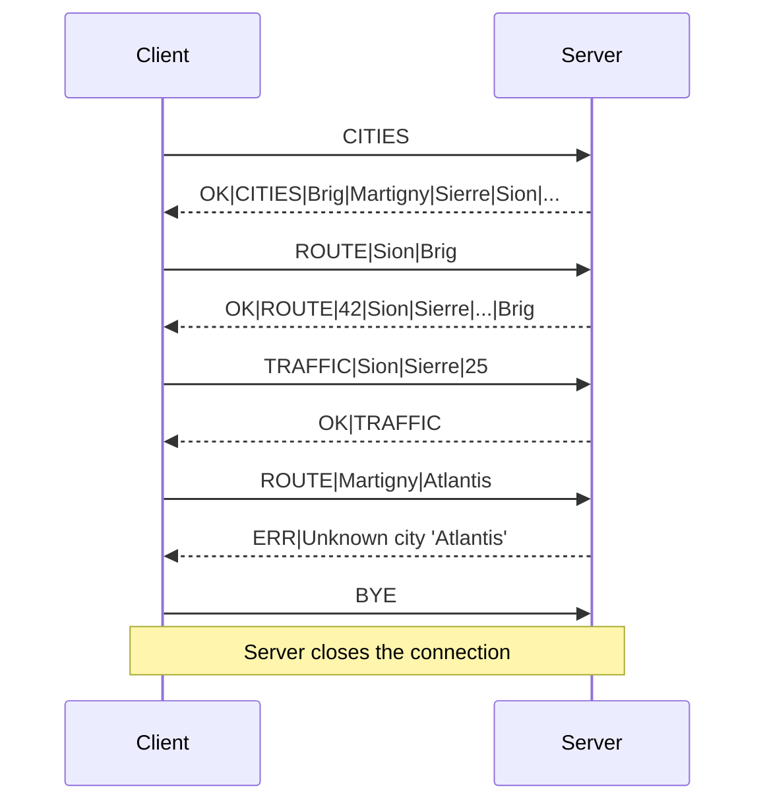

# Messaging protocol definition

Line-based text protocol over TCP (port **8888**). Each message is a single line, fields separated by `|`.

## Client → Server

| Command | Format | Description |
|---|---|---|
| `ROUTE` | `ROUTE\|FROM\|TO` | Ask for the shortest route from `FROM` to `TO`. |
| `TRAFFIC` | `TRAFFIC\|FROM\|TO\|OBSERVED_MINUTES` | Report the travel time a driver just observed on a direct road segment. The server **sets** the segment's current time to this value (it does not add to it), clamped so it never goes below the segment's base time from the map data. Reports are idempotent: two drivers observing the same jam converge on the same value. `FROM` and `TO` must share a direct road, otherwise the server replies `ERR`. |
| `CITIES` | `CITIES` | Ask for the list of all known city names (lets clients offer a selection instead of free-text input). |
| `BYE` | `BYE` | Disconnect. |

## Server → Client

| Reply | Format | Description |
|---|---|---|
| Route | `OK\|ROUTE\|ETA_IN_MINUTES\|CITY_1\|CITY_2\|...\|CITY_N` | The fastest route with its ETA and the cities along the way. |
| Traffic | `OK\|TRAFFIC` | Acknowledge the received traffic report. |
| Cities | `OK\|CITIES\|CITY_1\|CITY_2\|...\|CITY_N` | All known city names in stable order. |
| Error | `ERR\|MESSAGE` | The request was malformed or could not be served. |

## Example session

