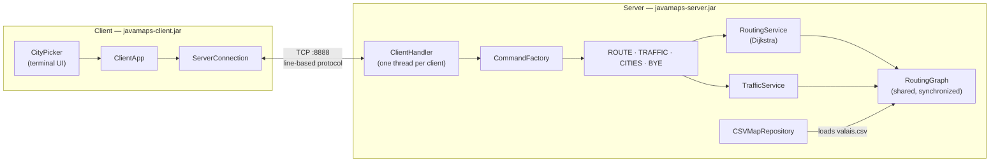

# JavaMaps

Real-time road traffic management system built with Java sockets. A TCP server holds the Valais road network and computes shortest routes via Dijkstra; a terminal client lets drivers request routes and report live travel times.

## Requirements

- Java 21+
- Maven 3.9+

## Build

```bash
mvn package
```

Produces two jars in `target/`:

| File | Purpose |
|---|---|
| `javamaps-server.jar` | Server (plain jar, no dependencies) |
| `javamaps-client.jar` | Client (fat jar — JLine bundled) |

## Run

**Start the server first:**

```bash
java -jar target/javamaps-server.jar
```

The server loads `valais.csv` and listens on port **8888**.

**Then start the client (in a separate terminal):**

```bash
java -jar target/javamaps-client.jar
```

Use the arrow keys to select cities. Press **Enter** to confirm. In environments without raw terminal support (e.g. IDE consoles) the client falls back to a numbered list.

## Usage

```
=== JavaMaps ===
1) Find a route
2) Report traffic
3) Quit
```

- **Find a route** — select departure and destination; the server returns the fastest path and ETA in minutes.
- **Report traffic** — select the road segment you just drove and enter how many minutes it took. The server updates the live weight for all future route requests.

## Architecture



The server accepts any number of clients, each handled on its own thread. All threads share one `RoutingGraph`; route computation and traffic updates synchronize on it.

## Protocol

Communication uses a line-based text protocol over TCP (pipe-separated fields). See [PROTOCOL.md](PROTOCOL.md) for the full specification.

## Running the tests

```bash
mvn test
```

## Project structure

```
src/
├── main/java/
│   ├── client/        # Client app and terminal UI
│   ├── common/        # Shared protocol constants
│   └── server/        # Server app, routing engine, TCP layer
└── test/java/
    └── server/        # Unit tests (Dijkstra, command factory)
```
