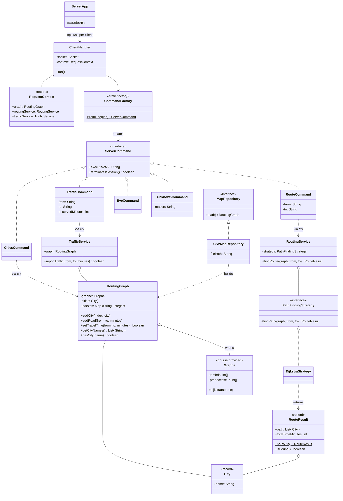
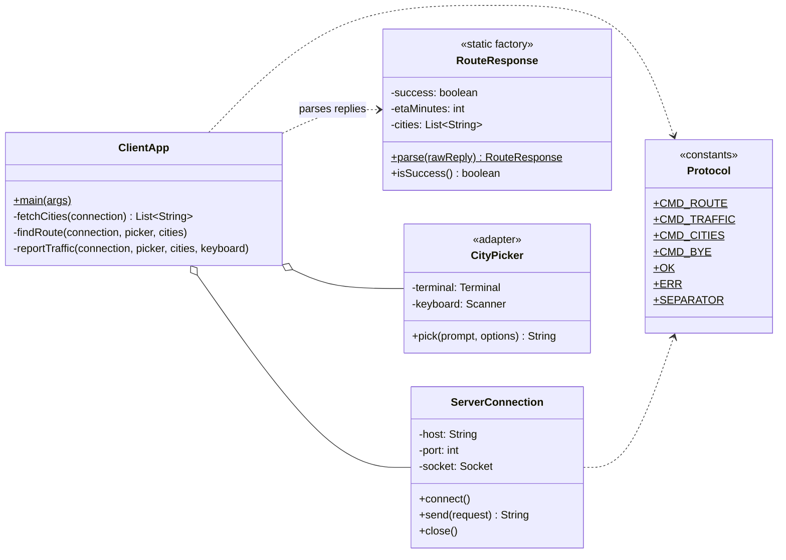

# JavaMaps — Real-Time Road Traffic Management System

**Module 63-31 — Final Report & Design Rationale**

---

## 1. Overview

JavaMaps is a client–server system that models a road network as a graph and answers
two questions in real time:

1. **What is the fastest route between two cities, and how long does it take?**
2. **A driver just observed traffic on a segment — update the network so future
   routes account for it.**

The server holds the network state and serves many clients concurrently over plain
TCP sockets. A console client lets a user query routes and report traffic. The
project is built around SOLID principles and a small set of deliberately-chosen
design patterns, with the goal of a codebase that is easy to explain, extend, and
modify.

The road network used for demonstrations is the Valais Rhône valley (Martigny → Brig),
loaded from a CSV resource.

---

## 2. System Architecture

### 2.1 Layered package structure

```
common/                         Shared protocol vocabulary (used by BOTH apps)
  Protocol                      Message keywords and the field separator

client/                         Console client
  ClientApp                     Menu loop (the only place that reads the keyboard)
  net/ServerConnection          Owns the socket; send(request) -> reply
  net/RouteResponse             Parses an OK|ROUTE / ERR reply into an object
  ui/CityPicker                 Arrow-key city selector (numbered-list fallback)

server/                         Server application
  ServerApp                     Boots the map, services, and the accept loop
  net/ClientHandler             One per client thread: read -> dispatch -> reply
  net/RequestContext            Carries shared services to each command
  net/command/                  One class per protocol request (Command pattern)
    ServerCommand, RouteCommand, TrafficCommand, CitiesCommand,
    ByeCommand, UnknownCommand, CommandFactory
  service/                      Application logic
    PathFindingStrategy         Routing abstraction (Strategy)
    DijkstraStrategy            Concrete routing algorithm
    RoutingService              Runs a strategy under the shared lock
    TrafficService              Applies traffic observations under the shared lock
  repository/                   Map loading
    MapRepository, CSVMapRepository
  domain/model/                 Data + graph
    City, Road, RoutingGraph, RouteResult
    Graphe, File, Noeud, Info   (course-provided graph data structure, reused)
```

The dependency rule is strict and one-directional: **the client and the server
depend only on `common`, never on each other.** This is what makes the two apps
independently deployable, and it is the reason the protocol constants live in their
own package.

### 2.2 Request lifecycle (a ROUTE query)

```
ClientApp menu
  → ServerConnection.send("ROUTE|Sion|Brig")
      → [socket] →
        ClientHandler.run() reads the line
          → CommandFactory.fromLine(...) returns a RouteCommand
            → RouteCommand.execute(ctx)
              → RoutingService.findRoute(...)  [synchronized on the graph]
                → DijkstraStrategy.findPath(...)
                  → Graphe.dijkstra(source) + path reconstruction
              → builds "OK|ROUTE|47|Sion|Sierre|Leuk|Visp|Brig"
      ← [socket] ←
  → RouteResponse.parse(reply)
  → ClientApp prints "Sion → Brig : 47 min / Via: ..."
```

Each arrow crosses a clean boundary. No layer reaches past its neighbour: the menu
never sees a socket, the socket never sees the protocol grammar, the command never
sees `readLine`, and the graph never sees the network.

### 2.3 UML Class Diagram

Two diagrams keep the picture readable: the **server** (domain, services, command dispatch) and the **client**. Arrows follow UML conventions: `<|..` realization (implements), `o--` aggregation (holds a reference), `..>` dependency (uses).

**Server**



**Client**



The course-provided helpers `File`, `Noeud`, and `Info` sit beneath `Graphe` (its adjacency lists) and are omitted from the diagram for clarity; `RoutingGraph` is the only class that touches them.

---

## 3. Communication Protocol

A line-based, pipe-delimited text protocol. Text was chosen over object
serialization because it is debuggable with a raw socket or `telnet`, language
agnostic, and trivial to log. The keywords and separator live as constants in
`common/Protocol`, so client and server can never drift apart.

**Client → Server**

| Message | Meaning |
| --- | --- |
| `ROUTE\|<from>\|<to>` | Ask for the fastest route and its ETA |
| `TRAFFIC\|<from>\|<to>\|<observed_minutes>` | Report the travel time a driver just observed on a direct segment |
| `CITIES` | Ask for the list of all known city names (drives the client's arrow-key picker) |
| `BYE` | Close the session |

**Server → Client**

| Message | Meaning |
| --- | --- |
| `OK\|ROUTE\|<eta>\|<city1>\|...\|<cityN>` | The ordered route and total minutes |
| `OK\|TRAFFIC` | Traffic report accepted |
| `OK\|CITIES\|<city1>\|...\|<cityN>` | All known city names in stable order |
| `OK\|BYE` | Acknowledged disconnect |
| `ERR\|<message>` | Human-readable error (unknown city, no route, no direct road, bad input) |

**Traffic semantics — absolute, not relative.** A `TRAFFIC` report *sets* a segment's
current time to the observed value (clamped so it never drops below the base time
from the map). This is detailed in the design log below; the short version is that
absolute observations are idempotent, so several drivers reporting the same jam
converge on one value instead of compounding it.

---

## 4. Design Decision Log

Each entry: **what & where**, **why**, **alternatives considered**, **trade-offs accepted**.

### 4.1 Strategy — pluggable routing algorithm
- **What/where:** `PathFindingStrategy` interface, `DijkstraStrategy` implementation,
  injected into `RoutingService`.
- **Why:** Decouples "I want a route" from "how the route is computed." A second
  algorithm (A\*) can be added as one new class and swapped in with a single line,
  touching no existing code.
- **Alternatives:** Call Dijkstra directly from the service.
- **Trade-offs:** One extra interface for a single implementation today — accepted
  because the project explicitly requires the Open/Closed ability to add algorithms.

### 4.2 Command + Factory — protocol dispatch
- **What/where:** `ServerCommand` with `RouteCommand` / `TrafficCommand` /
  `CitiesCommand` / `ByeCommand` / `UnknownCommand`; `CommandFactory.fromLine()`
  builds the right one.
- **Why:** Each request parses its own arguments and produces its own reply.
  `ClientHandler` becomes a generic loop (read → factory → execute → reply) with no
  knowledge of individual commands. Adding a command is one new class + one factory
  case, with `ClientHandler` untouched (Open/Closed). `CitiesCommand` proved this in
  practice: it was added late in the project and required exactly one new class and
  one factory case — no existing class changed.
- **Alternatives:** A large `if/else if` on the keyword inside `ClientHandler`.
- **Trade-offs:** More small classes — accepted for extensibility and testability
  (the factory is unit-tested in isolation).

### 4.3 Repository — map loading
- **What/where:** `MapRepository` interface, `CSVMapRepository` implementation.
- **Why:** Isolates "where the map comes from" behind an abstraction. A future
  database-backed source would require no change to callers.
- **Alternatives:** Hard-coded adjacency matrix in `main`.
- **Trade-offs:** An interface with one implementation — accepted; it also made the
  switch to classpath-resource loading a localized change.

### 4.4 Wrapping the legacy graph (adapter-style reuse)
- **What/where:** `RoutingGraph` wraps the course-provided `Graphe`/`File`/`Noeud`/`Info`
  structure and translates between city names and integer indices.
- **Why:** The course required reusing the provided data structure. Wrapping it lets
  the rest of the system speak in domain terms (`City`, `Road`) while the proven
  algorithm underneath is untouched.
- **Alternatives:** Rewrite the graph from scratch with a `Map<City, List<Road>>`.
- **Trade-offs:** A name↔index translation layer — accepted to honor the constraint
  and de-risk the algorithm.

### 4.5 Absolute traffic observations (vs. relative deltas)
- **What/where:** `TRAFFIC` carries an observed time; `RoutingGraph.setTravelTime`
  sets-and-clamps rather than adds.
- **Why:** Two drivers in the same jam each report "this took 40 min." With deltas
  these compound to +80; with absolute observations they converge on 40. Absolute
  values are idempotent and match what a driver actually knows (their trip time, not
  the road's baseline).
- **Alternatives:** Additive deltas (the first design).
- **Trade-offs:** A single bogus report fully overwrites the segment — acceptable
  because there is no authentication requirement, and concurrent writes then resolve
  to one real observed value rather than a corrupted sum.

### 4.6 Coarse lock for concurrency
- **What/where:** `synchronized (graph)` around both `RoutingService.findRoute` and
  `TrafficService.reportTraffic`.
- **Why:** Several client threads share one `RoutingGraph`. Dijkstra writes shared
  arrays (`lambda`, `predecesseur`) inside `Graphe`, and traffic mutates edge times,
  so route computation and updates must never interleave. One lock on the graph makes
  every read and write mutually exclusive.
- **Alternatives:** Per-edge locks, a copy-on-write/snapshot graph, lock-free reads.
- **Trade-offs:** All graph operations serialize. Accepted because a route on ~15
  cities completes in microseconds, so contention is negligible. At millions of nodes
  a snapshot-based read scheme would be warranted.

### 4.7 Null Object for "no route"
- **What/where:** `RouteResult.noRoute()` returns a real result whose `isFound()` is
  false, used for unreachable destinations and unknown cities.
- **Why:** Callers never receive `null` and never need a null check that could be
  forgotten. The strategy's contract is uniform.
- **Alternatives:** Return `null`; throw a `NoRouteException`.
- **Trade-offs:** `null` invites NPEs; an exception is the wrong vocabulary because
  "no route" is a normal answer to a valid question, not an exceptional program state.

### 4.8 Records for immutable data carriers
- **What/where:** `City`, `Road`, `RouteResult`, `RequestContext` are `record`s.
- **Why:** Immutable, concise, and they get value-based `equals()` for free — which
  made the domain trivially assertable in unit tests (`assertEquals(List.of(a,c,b), path)`).
- **Alternatives:** Classic classes with hand-written getters/equals.
- **Trade-offs:** None meaningful for pure data carriers.

### 4.9 Maven over Gradle
- **What/where:** `pom.xml`, standard `src/main` / `src/test` layout.
- **Why:** Reproducible builds and dependency management that live in the repo, not in
  IDE files. Maven's declarative model needs no custom build logic for this project.
- **Alternatives:** Gradle.
- **Trade-offs:** Less build flexibility — accepted, because this build needs
  *declaration*, not *programming*; Gradle's power would be unused complexity.

### 4.10 Negative knowledge — where principles/patterns were *not* applied
- **No Observer for traffic:** there is one consumer (the server log). Indirection
  would add ceremony with no payoff, and the pattern was outside the course material.
- **No Singleton for the graph:** it is passed explicitly via `RequestContext`.
  Explicit dependencies are testable; a singleton would hide state and complicate tests.
- **No interface for `City`/`Road`:** they are pure data records. Interface
  Segregation argues for small interfaces where behavior varies — not for putting an
  interface on every value object.
- **No Strategy for CSV parsing:** only one format exists. Abstracting it now is
  speculative generality (YAGNI).
- **No priority-queue Dijkstra:** the `sommetMin` linear scan is O(V²). A heap gives
  O(E log V) but the benefit only matters at thousands of nodes; the linear version is
  simpler to read and debug at this scale.

---

## 5. SOLID Principles in This Codebase

- **S — Single Responsibility.** Each class has one reason to change. Routing logic
  (`DijkstraStrategy`), result data (`RouteResult`), transport (`ServerConnection`,
  `ClientHandler`), parsing (`CommandFactory`, `RouteResponse`), and map loading
  (`CSVMapRepository`) are all separate. The new code never mixes computation with
  display.
- **O — Open/Closed.** New routing algorithms (via `PathFindingStrategy`) and new
  protocol commands (via `ServerCommand` + `CommandFactory`) are added without
  modifying existing classes.
- **L — Liskov Substitution.** `PathFindingStrategy` documents a behavioral contract
  ("never null; `isFound() == false` when no path"). `DijkstraStrategy` was fixed to
  honor it for unknown cities (returning a no-route result instead of throwing), so
  any future strategy is genuinely substitutable.
- **I — Interface Segregation.** Interfaces are minimal and single-purpose:
  `MapRepository` (load), `PathFindingStrategy` (findPath), `ServerCommand` (execute,
  plus a default `terminatesSession`). No client is forced to depend on methods it
  does not use.
- **D — Dependency Inversion.** `RoutingService` depends on the `PathFindingStrategy`
  abstraction, not on Dijkstra; `CSVMapRepository` sits behind `MapRepository`.
  Dependencies are injected (constructor injection, `RequestContext`) rather than
  reached through statics or singletons.

---

## 6. Concurrency and Data Consistency

- **Model:** one thread per client. `ServerApp` accepts a socket and hands it to a
  `ClientHandler` (a `Runnable`) on its own thread.
- **Shared state:** a single `RoutingGraph` instance, shared via one `RequestContext`.
- **Synchronization:** both the route computation (`RoutingService.findRoute`) and the
  traffic mutation (`TrafficService.reportTraffic`) synchronize on the graph object.
  This prevents two problems at once: a route being computed against a half-applied
  traffic update, and two simultaneous routes corrupting Dijkstra's shared working
  arrays.
- **Fault isolation:** a crashing or disconnecting client only ends its own thread.
  The accept loop and other clients are unaffected (`try`-with-resources on the socket
  guarantees clean teardown).

---

## 7. Robustness — Edge Cases Handled

| Scenario | Behavior |
| --- | --- |
| Route to an unreachable city | `ERR\|No route between X and Y`; server stays up |
| Unknown city name | `ERR\|Unknown city 'X'` (and the strategy itself returns no-route) |
| Traffic on a non-adjacent pair | `ERR\|No direct road between X and Y` |
| Absurd traffic value (overflow) | Rejected at the protocol boundary; Dijkstra also compares in `long` to be overflow-proof |
| Observation below base time | Clamped to the base time from the map |
| Client disconnects mid-session | Only that thread ends; the server keeps serving others |

---

## 8. Testing

- **Framework:** JUnit 5, run by Maven (`mvn test`).
- **Coverage:** the routing engine and protocol parsing — the parts with no socket
  dependency, which the layering made directly testable.
  - `DijkstraStrategyTest`: optimal-detour selection, path reconstruction order,
    no-route for an island, no-route for an unknown city, traffic-driven rerouting,
    ETA arithmetic.
  - `CommandFactoryTest`: each command is parsed correctly and malformed input becomes
    an `UnknownCommand`.
- **Why it matters here:** these tests are wired into the release pipeline (Section 9),
  so a regression cannot be published.

---

## 9. Build, Continuous Integration & Delivery

- **Build:** Maven produces two runnable jars (`javamaps-server.jar`,
  `javamaps-client.jar`), each with its own `Main-Class`. The map CSV is loaded as a
  classpath resource, so a packaged jar is self-contained and runs anywhere with
  `java -jar`.
- **CI:** a GitHub Actions workflow runs `mvn verify` on every push to `dev` and every
  pull request into `main` — the "does it still build and pass tests?" gate.
- **CD:** merging into `main` triggers a workflow that packages the jars (tests run
  first, so a red test blocks the release) and publishes them as a versioned GitHub
  Release.

---

## 10. Results

The system runs end-to-end against the Valais map:

- `ROUTE Sion Brig` returns `47 min` via Sion → Sierre → Leuk → Visp → Brig.
- Reporting heavy traffic on Sion–Sierre raises that segment's time and reroutes the
  next query via St-Léonard, demonstrating live, traffic-aware routing.
- Reporting the same jam twice leaves the segment unchanged (idempotent), and a low
  observation clamps back to the base time.
- Multiple clients connect simultaneously; an update from one is visible to the next
  query of another, confirming shared, consistent state.

All required project tasks — graph representation, real-time updates, socket
client/server, shortest-path calculation, SOLID + design patterns, and concurrency —
are implemented and demonstrable.

---

## 11. How to Build and Run

```bash
# Build everything and run the tests
mvn clean package

# Terminal 1 — start the server (listens on port 8888)
java -jar target/javamaps-server.jar

# Terminal 2 — start the client and use the menu
java -jar target/javamaps-client.jar
```

The protocol is also reachable directly for testing, e.g. with a raw socket sending
`ROUTE|Sion|Brig`.
